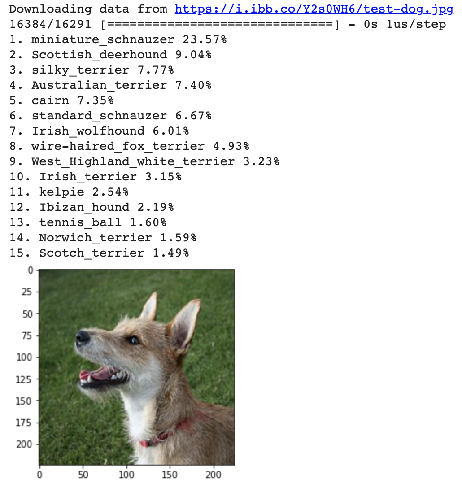

## Introduction

### What is machine learning?

Machine learning means that a computer program improves through experience; it does not need a programmer to alter the program for it to improve. The computer tests a way to complete a task, measures its success, and then changes its approach and tests it again, and again. It always tries to improve on its measurement of success.

While there are lots of different types of machine learning, this project focuses on **image classification**: an image is taken and the computer has to recognise which class the supplied image is most likely to belong to (it chooses from a number of 'classes' of images the computer has been taught to recognise).  

One of the most famous examples of machine learning is to ask whether a picture contains a cat or a dog. The computer can do this because it has been shown thousands of examples of what cats and dogs look like. From these, it builds a **model** — a set of rules for how to decide that an image contains a dog or a cat. 

A weakness of image classification is that a program that has been trained only on cats and dogs *always* guesses that something is either a cat or a dog. Image classification programs don't have the ability to recognise things that were not part of their training, and they likewise can't decide whether an image contains none of the things they have been trained to recognise.

### What you will make
You will create a Python function to test a computer's recognition of an object, then you will supply a photograph of that object and receive the computer's guess about what it is. This will be a useful tool for you in future projects, so you can test the models you create, and get the results of others' models when using them as part of an application. For this project, you will use Google Colab — an online tool used to write and run machine learning programs.

--- collapse ---
---
title: What you should already know
---
This project assumes you already know some Python. Specifically, it assumes you know how to use:

+ Variables
+ Lists
+ Functions, including how to create your own function that accepts arguments

--- /collapse ---

--- collapse ---
---
title: What you will need
---

+ A computer
+ An internet connection
+ A Google account — if you don't have one, the next step will tell you how to get one

--- /collapse ---

--- collapse ---
---
title: What you will learn
---

+ What machine learning is
+ What a 'model' is (in the context of machine learning)
+ How the limitations of machine learning could impact your project

--- /collapse ---

--- collapse ---
---
title: Additional information for educators
---

If you need to print this project, please use the [printer-friendly version](https://projects.raspberrypi.org/en/projects/testing-vision/print){:target="_blank"}.

[Here is a link to the resources for this project](http://rpf.io/testing-vision-go).

--- /collapse ---
