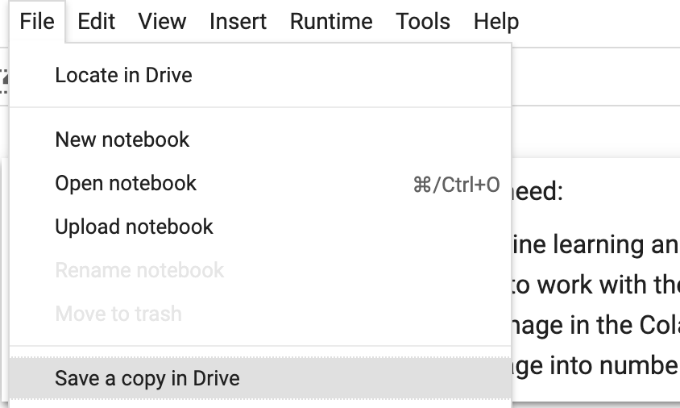
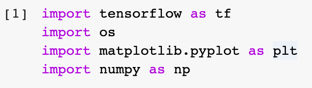

## Get started with Google Colab
Machine learning needs a lot of data, and a lot of computer processing power. Most personal computers are too slow to train a model, and most internet connections are too slow to download large enough amounts of data to train it with. So, for this project you're going to use Google Colab. It's an online tool to write and run machine learning code with the TensorFlow library, which is a collection of machine learning tools created by Google. This lets you use Google's much more powerful computers, and faster internet connection.

--- task ---

Make sure you have your Google account username and password.

If you don't have an account, [a parent may be able to create one for you](https://support.google.com/families/answer/7103338){:target="_blank"} or, if you're old enough to do so under your country's laws, you can [create your own account](https://accounts.google.com/signup){:target="_blank"}.

--- /task ---

--- task ---

Open the [starter](https://colab.research.google.com/drive/12KHBw8tn3s9NkcXXUK2MdhC9hLpHAxLs?usp=sharing){:target="_blank"} for this project in a new tab in your browser. 

--- /task ---

This is your first Google Colab **notebook**. Notebooks allow you to store text, Python code, and the output of that code together. It can be helpful to keep notes to remind yourself of what your code does at different points, or to add notes for other people who may look at your work in future.

This notebook already has some code and text in it to take care of a few things that you don't need to worry about just now (to load the image you want to identify, and take the outputs from the model you're using and display them in a human-readable way).

--- task ---

Before you start to change anything, make sure you save the notebook to your drive so you can keep your work! Choose `File > Save a copy in Drive` and sign in to your Google account if prompted.

--- /task ---

The Python code and text in the notebook is broken up into **cells**. Each code cell can be run separately, while allowing variables and functions from one cell to be accessed from others. This can be very useful if you need to run a piece of code that takes a long time to run — like to train a machine learning model — but you don't need to rerun it every time you want to change code that uses the model. However, you're not going to need to do that in this project because you need to run all the cells, in order.

--- task ---

Check that you can run all the code in the notebook by going to the `Runtime` menu and choosing `Run all`.

--- /task ---

You should see spinners appear in the code cells, and then see numbers appear in the square brackets to the side of the cells. These numbers indicate the order in which the code was run. This is to make sure that you're able to run code in your notebook when you need it later.

Notice that the last few code cells — the empty ones — all have the same number as the last cell that actually contains code. This is because they're empty right now, so there was nothing new there to run.
