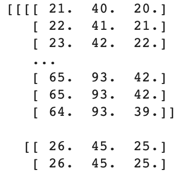
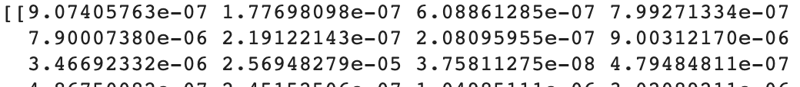

# Use the model to predict an image
Now that you can load your model and an image, it's time to pass the image to the model and see what it thinks it's looking at.

However, machine learning models can't actually understand images the way humans do — they need to see everything as numbers. In the case of an image, that means the amount of red, green, and blue light in every pixel of the image. So before you can give the image to your model, you'll need to convert it into lists of numbers. Luckily, the TensorFlow and NumPy libraries can help you.

--- task ---

Add code to the end of your `classify_image` function to use the TensorFlow library to convert the image to an array (which is very similar to a list). Then, use NumPy to reshape that array to exactly what the model expects:

```python
  image = tf.keras.preprocessing.image.img_to_array(image)
  image = np.expand_dims(image, axis=0)
```

--- /task ---

If you want to see what the image looks like to your model, try printing out all those numbers!



Next, you need to ask your model for a classification based on your image. This uses the `predict` method of your model.

--- task ---

Get your model's classification of the image and store it in a variable named `classification_result`. 

Note that, as well as passing the model your image, you also have to tell it that it's only receiving one image, using the `batch_size` parameter. This is because you can ask the model to classify many images at once.

Add this line to the end of the `classify_image` function:

```python
  classification_result = model.predict(image, batch_size=1)
```

--- /task ---

If you print out the results the model has given back, you'll see that it's just a lot of numbers. This is a long list of how likely the model thinks the image is to belong to every class it has been trained to recognise. In the case of the VGG16 model you're using here, that's 1000 classes! The model is splitting a total of 100 percent across all of its classes, the ones it thinks are better matches for your image get large percentages, and those it's less confident about get little or nothing.



Now, since you really only care about the few classifications that the model thinks are most likely — it's probably not confusing an image of a dog with one of a car, for example — the next thing to do is match up the highest of those classification numbers with the labels for each of the categories. Luckily, yet again, there is a TensorFlow function for that!

--- task ---

Still working at the end of your `classify_image` function, create a variable called `classifications`. Then use this rather long TensorFlow function to take `classification_result` and get the labels for the top 15 results.

```python
  classifications = tf.keras.applications.imagenet_utils.decode_predictions(classification_result, top=15)
```

--- /task ---

--- task ---

Finally, finish the `classify_image` function by adding the `print_classifications` function to the end of it. This function is already provided in the notebook and will display the classifications the model has made.

```python
  print_classifications(classifications)
```

Now run the code and see what your program predicts!

--- /task ---

--- save ---


Number 1 is the classification the model thinks is most likely to be right, number 2 is its next best classification, and so on. You can see how the percentages associated with the classifications shrink as you move down the list. To see more of the classifications, and try to find the point where they hit 0 percent, change the value of `top` where you call the `decode_predictions` function and rerun the program.

#### A strange classification

Notice how most of the classifications are sensible — different kinds of dog.  However, look at number 13 — 'tennis ball' — that's a bit different! Why might the model think that it sees a tennis ball? It's probably because of the way models are trained: they're shown images to learn from, and then given other images to test their learning. The image you've asked it to identify here is a dog and some grass. Do you think it's likely some pictures of dogs might show them playing with balls? Or that pictures of balls might show them on grass? You can see how the classifier might get confused!
